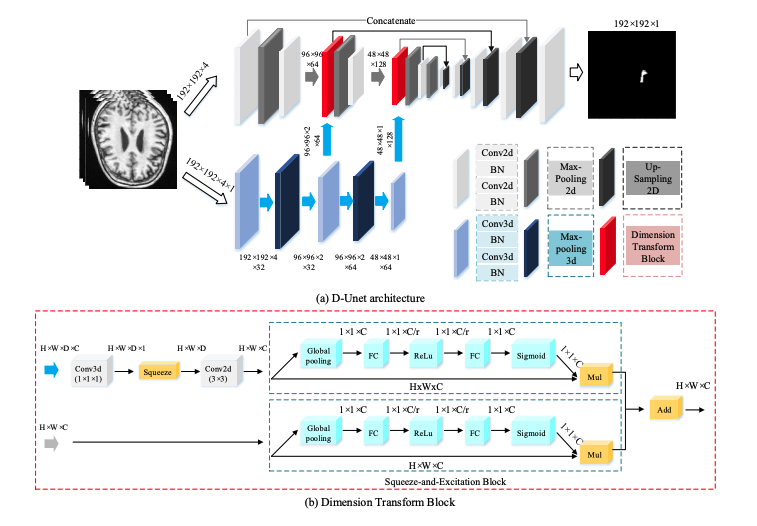

# D-Unet: a dimension-fusion U shape network for chronic stroke lesion segmentation
####  D-Unet implemented in PyTorch




## Usage

```python
from DUnet import DUnet
import torch

BATCH_SIZE = 8
input_batch = torch.Tensor(BATCH_SIZE, 4, 192, 192)

model = DUnet(in_channels = 4)

output_batch = model(input_batch) # output_batch size : (BATCH_SIZE, 1, 192, 192)
```

- According to the Reference paper input size must be (4, 192, 192) and output size must be (1, 192, 192)


## Reference

[1] Yongjin Zhou et al., D-UNet: a dimension-fusion U shape network for chronic stroke lesion segmentation ([ arXiv:1908.05104](https://arxiv.org/abs/1908.05104) [eess.IV] ), 2019 Aug

[2] SZUHvern github source code implemented with keras (https://github.com/SZUHvern/D-UNet)

